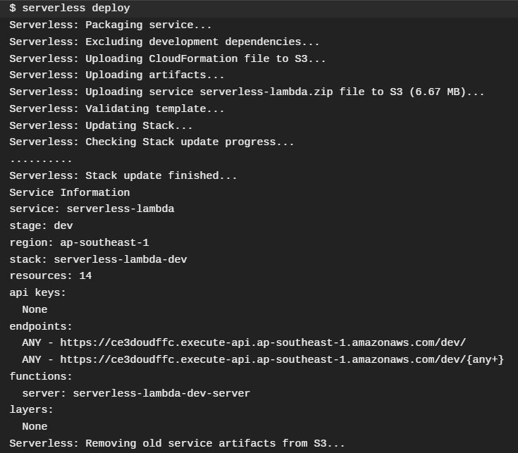

# full-stack


# About Project
A full-stack application that manages inventory items.

This project is split into 4 parts. Note that each part builds on the previous part. 
- Part 1: Create RESTFUL API and deploy endpoints.
- Part 2: Create test cases and integrate Continuous Integration(CI) tool.
- Part 3: Deploy API endpoints to serverless service and integrate Continuous Deployment(CD) tool.
- Part 4: Build a frontend SPA

# About Files
- resthub (Server folder)
    - data (to store database data)
    - images (images used in README)
    - test (test cases)
- vue-client (Client folder)
    - src
        - components (Reusable components)
        - assets (images, etc)

# Content Page
1. Part 1
    1. [Install](#install)
    1. [How to run the API locally](#How-to-run-the-API-locally)
    1. [Deploying endpoints](#Deploying-endpoints)
    1. [Database Data Structure](#Database-Data-Structure)
    1. [Example of API Calls using Postman](#Example-of-API-Calls-using-Postman)
1. Part 2
    1. [How to run tests locally](#How-to-run-tests-locally)
    1. [How Travis is used for automated testing](#How-Travis-is-used-for-automated-testing)
1. Part 3
    1. [How to access deployed endpoints on AWS Lambda using Postman](#How-to-access-deployed-endpoints-on-AWS-Lambda-using-Postman)
    1. [How Travis is used for automated deployment](#how-Travis-is-used-for-automated-deployment)
1. Part 4
    1. [How to setup the frontend client](#How-to-setup-the-frontend-client)

# Part 1
Create a simple RESTFUL API that manages inventory items. This is done via GET, POST, PUT, DELETE API calls locally or through deployed endpoints using Postman.

Tech Stack:
- SERVER: `NodeJS`
- DATABASE: `MongoDB`

## Install
- [npm](https://www.npmjs.com/get-npm)
- [Node](https://nodejs.org/en/download/)
- [MongoDB](https://www.mongodb.com/try/download/community)
- [Postman](https://www.postman.com/downloads/)


## How to run the API locally
1. Download or Clone the repository.
2. Open Command Prompt and change your directory to `resthub` by typing `cd resthub`.
3. To start the database (*MongoDB*), type `npm run mongo`. 
    > This Command Prompt must remain **open** for the *database* to run.
4. To download the dependencies needed, open another Command Prompt in the same directory and type `npm install`.
5. To start the server (*NodeJS*), type `npm run dev`.
    > This Command Prompt must remain **open** for the *server* to run. You should see the following result:

    ```
    [Server] Running RestHub on port 8080. [State: development]
    [Database] Database connected successfully.
    [Database] Sample data added.
    ```
6. And you're done! Open `Postman` and try out GET, POST, PUT and DEL API calls. Refer to the [API Calls](#Example-of-API-Calls-using-postman) below for examples.

## Deploying endpoints
### Information of Deployed API
- Server (*NodeJS*) is deployed on `Amazon Web Services (AWS)`. 
    > http://resthubserver-env.eba-ykb43kxe.us-east-2.elasticbeanstalk.com/
- Database (*MongoDB*) is deployed on `MongoDB Atlas`.

*NOTE: This is deployed on `Amazon EC2` which is not serverless. For deploying API to serverless service, please refer to [Part 3](#Part-3).*

### Instructions to access deployed endpoints on `Amazon EC2` using Postman
1. To access the deployed endpoints, open up your browser or `Postman`, and enter the following links to do a GET request:

    http://resthubserver-env.eba-ykb43kxe.us-east-2.elasticbeanstalk.com/api/items (To display all items)

    http://resthubserver-env.eba-ykb43kxe.us-east-2.elasticbeanstalk.com/api/items/1 (To display item with id 1)

    *It uses `/api/items` route, which is the same as the localhost.*
2. For the other type of request, refer to the [API Calls](#Example-of-API-Calls-using-postman) below for examples. 
    > Replace http://localhost:8080/ with
    > http://resthubserver-env.eba-ykb43kxe.us-east-2.elasticbeanstalk.com/ in the examples.


## Database Data Structure
The database only consists of 1 data structure which is `items`.

It consists of the following fields: (FORMAT: [NAME : DATATYPE])
- name: `string` (required)
- quantity: `Number` (required)
- price: `Number`
- seller_info
  - name: `string`
  - phone: `string`

Sample data:
```
{
    "name": "Canned Food",
    "quantity": 10,
    "price": 10.50,
    "seller_info": {
        "name": "Chloe",
        "phone": "92235003"
    }
}
```

## Example of API Calls using Postman
1. `GET` Request

    http://localhost:8080/api/items (To display all items)
    http://localhost:8080/api/items (To display item with id 1)

    Example
    

2. `POST` Request

    http://localhost:8080/api/items (To add an item)
    
    Example
    
    
3. `PUT` Request

    http://localhost:8080/api/items/1 (Update item with id 1)

    Example
    

4. `DELETE` Request

    http://localhost:8080/api/items/1 (Delete item with id 1)

    Example
    

# Part 2
Create test cases for the API calls and use Continuous Integration(CI) tool to automate testing.

Tech Stack:
- Testing Framework: `Mocha`
- Assertion Library: `Chai`
- CI Tool: `Travis`

## How to run tests locally
1. Under `resthub` directory, type `npm install` to download all dependencies.
2. Before running the test, start the database by typing `npm run mongo`.
    > This Command Prompt must remain **open** for the *database* to run.

    > To keep the development/production database clean, test cases are executed on another database.
3. Open another Command Prompt in the same directory, and type `npm run test`. This will execute the test cases. The output is as shown below.

    

## How Travis is used for automated testing
1. To use `Travis` to automate testing, `.travis.yml` file is configured and placed under the root folder. In this case, it will trigger a build under the directory, `resthub`.
    
    ```
    language: node_js
    node_js:
    - 12

    services:
    - mongodb

    env:
    - TEST_DIR=resthub

    script:
    - cd $TEST_DIR && npm install && npm test
    ```
2. For every commit to `master` branch, `Travis` will automatically trigger a build. It will check if the recent commit can pass all the test cases. 

    To view the most recent build:

    https://travis-ci.org/github/junnbang/full-stack

    Screenshot of Travis Build:
    

# Part 3
Deploy API calls to serverless service and use Continuous Deployment(CD) tool to automate deployment.

Tech Stack:
- Serverless service: `AWS Lambda`
- Serverless framework: `serverless`
- CD Tool: `Travis`
- Cloud Database: `MongoDB Atlas`

Screenshot of AWS Lambda application:


## How to access deployed endpoints on `AWS Lambda` using Postman
1. To access the deployed endpoints, open up your browser or `Postman`, and enter the following links to do a GET request:

    https://ce3doudffc.execute-api.ap-southeast-1.amazonaws.com/dev/api/items (To display all items)

    https://ce3doudffc.execute-api.ap-southeast-1.amazonaws.com/dev/api/items/1 (To display item with id 1)

    *It uses `/api/items` route, which is the same as the localhost.*
2. For the other type of request, refer to the [API Calls](#Example-of-API-Calls-using-postman) below for examples. 
    > Replace http://localhost:8080/ with
    > https://ce3doudffc.execute-api.ap-southeast-1.amazonaws.com/dev/ in the examples.

## How Travis is used for automated deployment
1. To deploy the API to a serverless service, it uses the `serverless` framework to deploy to `AWS Lambda`. The serverless config is in `.serverless.yml` under `resthub` folder.
    > *NOTE*: The `MongoDB Atlas's User Access Credentials` have to be input in the `ENVIRONMENT VARIABLES` in `AWS Lambda`'s setting so that the AWS Lambda can connect to the MongoDB Atlas's cloud database.

    Screenshot of deployed endpoints:
    
2. To automate the deployment, `Travis` is used as a CD tool. For every commit to `master` branch, `Travis` will automatically trigger a build and check if it passes all the test cases. If it passes all test cases, the latest version will automatically be deployed to AWS Lambda.
    > *NOTE*: The `AWS's User Access Credentials` have to be input in the `ENVIRONMENT VARIABLES` in `Travis`'s setting so that Travis can automatically connect to the AWS Lambda and deploy the latest version.

# Part 4
Build a frontend client and styling it using framework.

Tech Stack:
- Frontend framework: `Vuejs`
- CSS framework: `bootstrap-vue`

Screenshot of Frontend application:


Screenshot of form used to add and edit record:


## How to setup the frontend client
1. Ensure that the database and server is running first. Refer to [Setup](#How-to-run-the-API-locally) if server is not setup.
2. Open Command Prompt and go to `vue-client` directory.
3. To download the dependencies, type `npm install`.
4. To start the client, type `npm run serve`. The output should be as shown below:
    
    
5. Go to browser and type http://localhost:8081. You should see the home page as [above](#Part-4).
6. To interact with the API, click on `Add a Record` for manual inputs or `Add a Sample Record` for ease of use.
7. After a record has been added, it can be edited or deleted by clicking the buttons in their respective rows.
> *NOTE: The API is linked to the localhost and NOT the deployed endpoints.*


---------
*This project is built for CS3219 OTOT-assignment.*